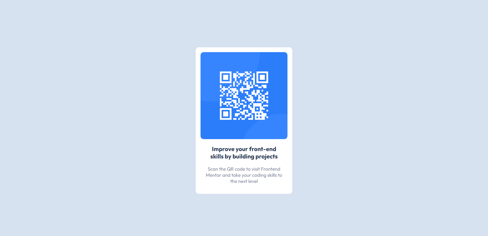

# QR code component solution

This is a solution to the [QR code component challenge on Frontend Mentor](https://www.frontendmentor.io/challenges/qr-code-component-iux_sIO_H). Made by Fernando Valerio

## Table of contents

- [QR code component solution](#qr-code-component-solution)
  - [Table of contents](#table-of-contents)
  - [Overview](#overview)
    - [Screenshot](#screenshot)
    - [Links](#links)
  - [My process](#my-process)
    - [Built with](#built-with)
    - [Continued development](#continued-development)
  - [Author](#author)

## Overview

### Screenshot

  

How it looks on Mobile

  

  How it looks on Desktop

### Links

- Solution URL: [Add solution URL here](https://your-solution-url.com)
- Live Site URL: [Add live site URL here](https://your-live-site-url.com)

## My process

### Built with

- HTML5
- CSS custom props
- Flexbox
- Mobile-first development

### Continued development

I want to focus on responsive design and work with frontend frameworks like React or Vue. I want to master my CSS abilities.

## Author

- Website - [fvwebsite](https://fvwebsite.netlify.app/)
- Frontend Mentor - [@fva062001](https://www.frontendmentor.io/profile/fva062001)
- Github - [@fva062001](https://github.com/fva062001)

